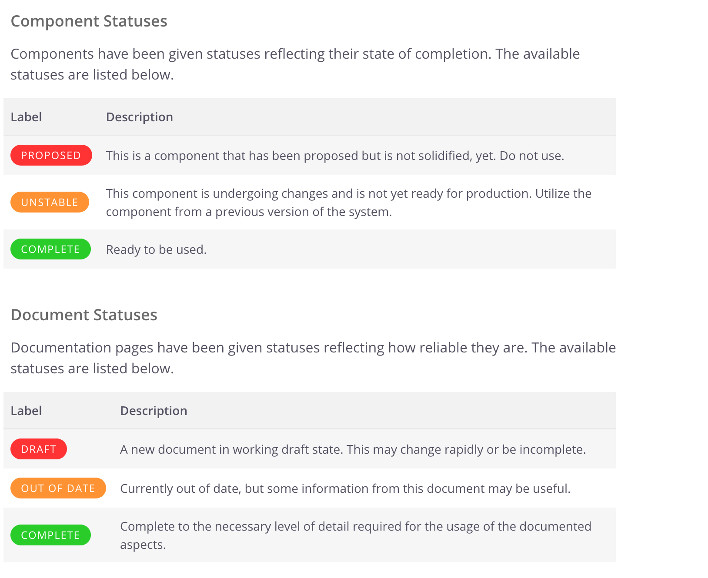

# fractal-status-helper
A helper for the Fractal styleguide system that allows you quickly display status tables

## Example
This module allows you to have the following in your fractal documentation:
```
### Component Statuses
Components have been given statuses reflecting their state of completion. The available statuses are listed below.

{{# componentStatuses}}{{/ componentStatuses}}

### Document Statuses
Documentation pages have been given statuses reflecting how reliable they are. The available statuses are listed below.

{{# documentStatuses }}{{/ documentStatuses }}
```

to generate this:


## Installation
```
npm install fractal-status-helper
```

## Usage
Inside of your `fractal.js` file, add the following require statement, after you define `fractal`:
```
const fractal = module.exports = require('@frctl/fractal').create();
...
const FractalStatusHelper = require('fractal-status-helper')(fractal);
```

Then, during your initialization of your documents later in the file, setup the engine to use handlebars (for documents only - you can use nunjucks for components), and declare the helpers:
```
fractal.docs.engine(require('@frctl/handlebars')({
    helpers: {
        componentStatuses: FractalStatusHelper.componentStatusTable,
        documentStatuses: FractalStatusHelper.documentStatusTable
    }
}));
```

Now, in your documents, you can use `{{# componentStatuses }}{{/ componentStatuses }}` and `{{# documentStatuses }}{{/ documentStatuses }}` wherever you want to generate a table of the statuses!
